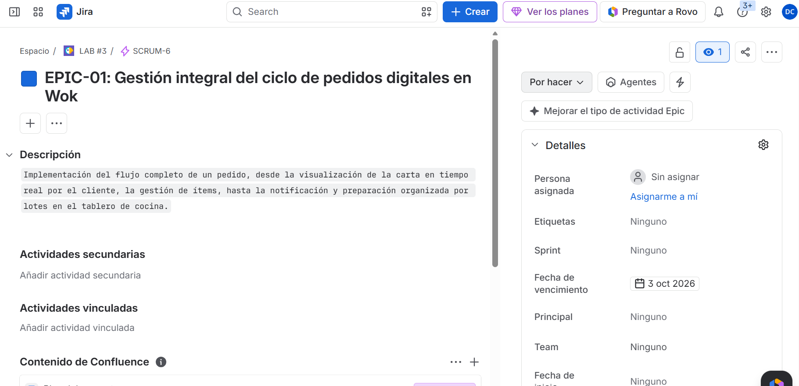
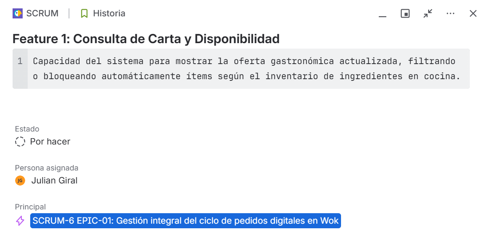
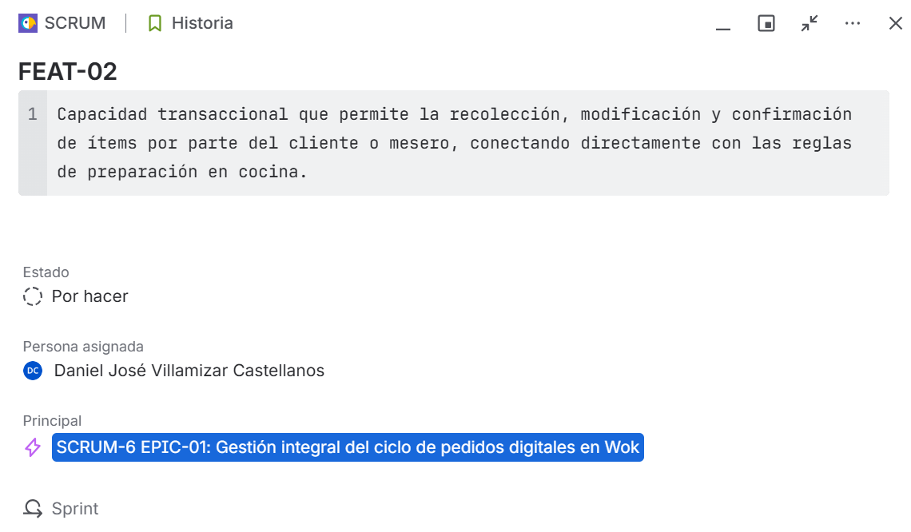

# Evidencias de Configuración en Jira - Laboratorio 3

A continuación se presentan las evidencias del traslado del Product Backlog a la herramienta Jira, manteniendo la jerarquía Ágil requerida.

## 1. Épica Configurada
*Descripción: Épica principal con título, descripción, fecha de vencimiento y etiqueta del concepto.*

## 2. Jerarquía de Features
*Descripción: Los dos features (Consulta de Carta y Armado de Pedido) vinculados como hijos directos de la Épica.*

## 3. Historias de Usuario (con Criterios de Aceptación)
*Descripción: Historias de usuario detalladas con formato "Como/Quiero/Para" y criterios "Dado/Cuando/Entonces".*